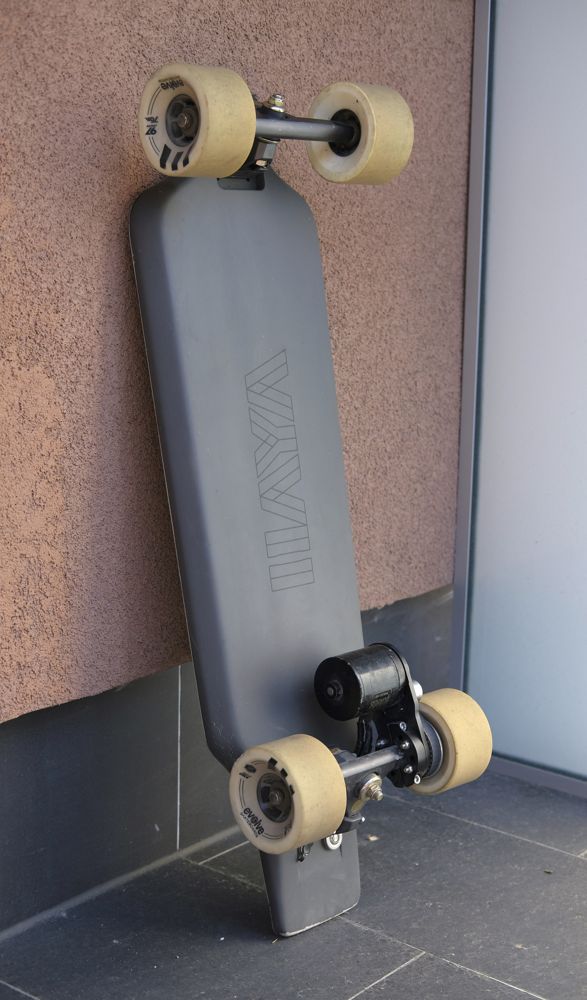

= Hayaku board docs

:source-highlighter: coderay
Daniils Petrovs <thedanpetrov@gmail.com>

A collection of docs, manuals and useful information about my Hayaku electric skateboard.

== Navigation

* link:specs.adoc[Specs]
* link:parts.adoc[Parts]
* link:configuration.adoc[Configuration]

Many details of the board specs, parts and build story can be found on the link:https://forum.esk8.news/t/hayaku-10s5p-single-drive-haya-hb83-shortboard/17841[esk8 forums].

== How to compile the docs

Make sure you have `Ruby` installed, then install `asciidoctor`.

[source, shell]
----
gem install asciidoctor
----

For PDF, make sure to also install `asciidoctor-pdf`

[source, shell]
----
gem install asciidoctor-pdf --pre
----

Then run

    make docs